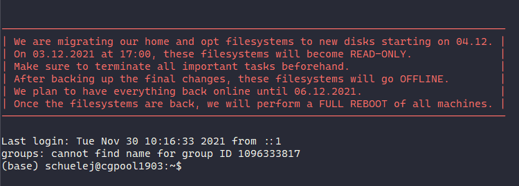

## Agenda
### HiWi
* Kugel ist fertig  
	
* GUI mit Beispielberechnung im separaten Thread ist fertig  
	

## To do (from last week) [2021-11-30](unlisted/minutes/2021-11/2021-11-30.md)
### HiWi
* [x] Make light follow camera rotation
* [x] Enable camera movement parallel to an ongoing rendering calculation (s. example with the sphere to cow rendering)
* [x] Weihnachtskugel malen
* [ ] Docs for Studienarbeit code (Kalman filter)

### MA
* [ ] Train model skeletonised -> node attributes using existing data
	* [ ] Debug `DataGenerator`
* [ ] Preliminaries
	* [ ] Data augmentation - debug
	* [ ] Data generation
		* [ ] Watch more videos and trim away bad sections
		* [ ] Adjust filter parameters so that more structures are visible
		* [ ] Training data generation up to 3k w/o data augmentation

## Notes
* 